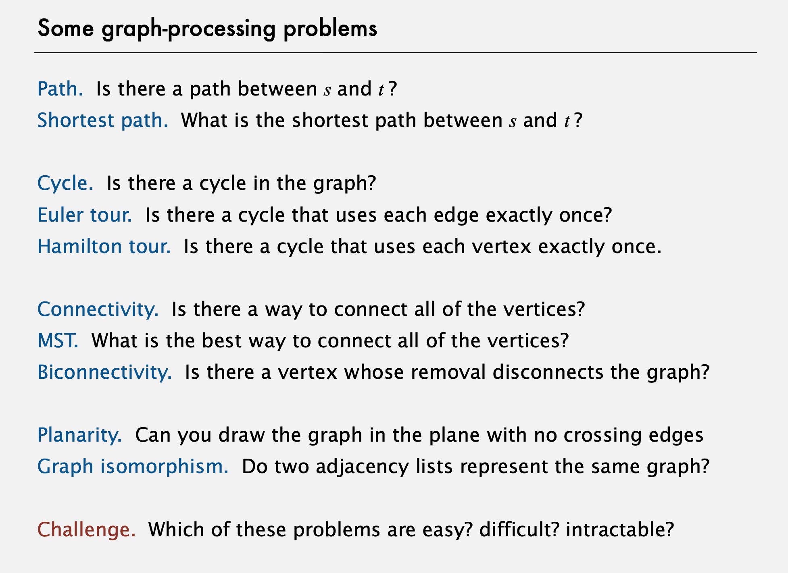

# Trees & Graphs



## Tree common algorithms

<!-- markdownlint-disable MD033 -->
<details><summary>Tree Height</summary>
<p>

* [104. Maximum Depth of Binary Tree](https://leetcode.com/problems/maximum-depth-of-binary-tree/)
* [110. Balanced Binary Tree](https://leetcode.com/problems/balanced-binary-tree/)
* [543. Diameter of Binary Tree](https://leetcode.com/problems/diameter-of-binary-tree/)

</p>
</details>


## Binary Tree Traversal

Different traversal order


### Inorder
left -> root -> right

[Python](./../../algorithms/python/BinaryTreeInorderTraversal/BinaryTreeInorderTraversal.py)

### Preorder
root -> left -> right

Derived DFS.

[Python](./../../algorithms/python/BinaryTreePreorderTraversal/BinaryTreePreorderTraversal.py)

### Postorder
left -> right -> root

Derived DFS.

[Python](./../../algorithms/python/BinaryTreePostorderTraversal/BinaryTreePostorderTraversal.py)

### Level Order
Traverse the tree one layer at a time
```
     3
    / \
   9  20
     /  \
    15   7
------------
[
    [3],
    [9, 20],
    [15, 7]
]
```
This is similar to Bread-first Search. The trick is to use a queue, and iterate the length of the queue to store each layer node.

[Python](./../../algorithms/python/BinaryTreeLevelOrderTraversal/BinaryTreeLevelOrderTraversal.py)

## Graph Search

### Bread-first Search (BFS)

[Python](./BFS.py)

### Depth-first Search (DFS)

[Python](./DFS.py)
